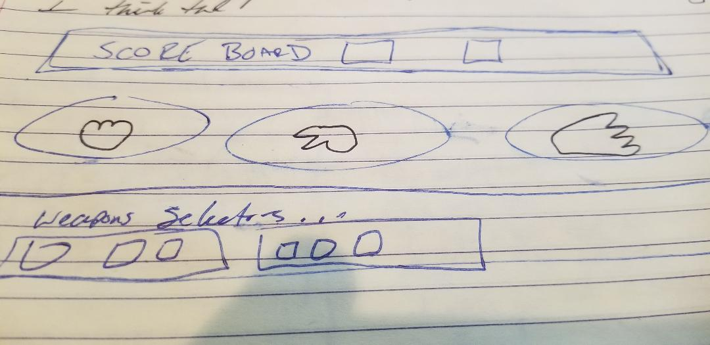

<<<<<<< HEAD
# project1

Rockpaperscissors game
=======

Rockpaperscissors game 
>>>>>>> c1900256f2597bcbf39469780ee95653e2bb4134
**User stories**
-user can pick a hand
-computer pick random hand
-user can keep track of who won
-use can bet on rounds
-user has option of different hand shapes
-user has real cool buttons

I made a rock paper scissors game because I like rock paper scissors and I've used it as a coin toss mechanism in real life to make decisions. 
I added game modes to make it more interesting and I made a class to make adding game modes a little easier.
I learned about psuedo-css code with the buttons to customize them a bit and correct unintended formatting when adding bootstrap. 
This was also a fun exercise in flex box. because I overcoded and it was bad. so I dialed back and simplified it and it worked out a  lot better. 

<<<<<<< HEAD
wireframe

=======
>>>>>>> c1900256f2597bcbf39469780ee95653e2bb4134

